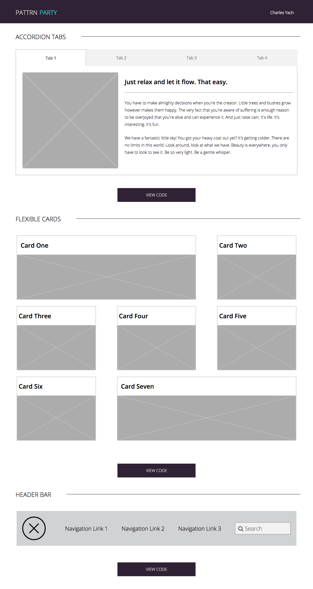

# PATTRN PARTY

#### Very often the same page elements are built many times over. On large projects, same type of elements are built numerous times in slightly different ways. This can quickly lead to visual inconsistencies, unclear design, and hard-to-maintain code. 

#### By focusing on the parts that make up the whole,consistency of elements is maintained across the site, and to build content that is modular with a cohesive design approach tying it all together.

#### The pieces in this style guide serve as a base template to refer back to to get these elements built more quickly and more consistently the next time they are needed.

## Accordion Tabs

#### These tabs make use of a very common layout seen in many web pages. A user can click on a the table title to easily page between content. The layout takes a horizontal approach for the tabs until the screen size reaches a tablet width. At that point the tab titles move to a vertical layout with larger tabs for easier access on a handheld device.

## Flexible Cards

#### The flexible cards are another popular layout. This is more of a grid approach with a few different sized cards. They all maintain equal space from each other so as not to get too crowded or distant. At a tablet screen width the layout drops to a two column situation, then down to one column for mobile. This insures that the content is never too small regardless of screen size.

## Header Bar

#### The header, or navigation, bar is extremely common in web pages. This particular style shows navigation links with a search bar that maintain their appropriate area relative to screen size. As the screen size decreases, there is no longer room for each link title, and thus the bar switches in to a drop down mode. This allows the bar to take up less space until needed. With a simple hover the links and search bar reappear with generous sized areas.

